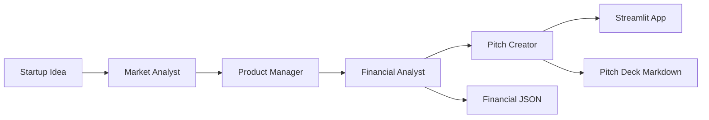

# Startup-in-a-Box

Startup-in-a-Box is a multi-agent AI application that turns a raw startup idea into an investor-style pitch package. It coordinates specialized agents for market research, product planning, financial modeling, benchmark research, and pitch deck generation through a Streamlit interface.

This project was built as a portfolio-ready demonstration of applied LLM orchestration, structured output validation, web-grounded financial research, and clean product UX.

## What It Does

- Converts a startup idea into a structured market analysis.
- Produces a focused product specification from the market report.
- Uses Groq Compound web search to find related-industry financial benchmarks.
- Builds 5-year financial projections with validation for revenue, costs, profit, and break-even logic.
- Generates a Marp-compatible investor pitch deck.
- Saves downloadable outputs as Markdown and JSON.

## Key Engineering Highlights

- Multi-agent workflow with clear ownership between market, product, finance, and pitch agents.
- Web-grounded finance step that separates public data from estimated benchmark ranges.
- Pydantic validation for deterministic financial projection structure.
- Revenue consistency checks to prevent incorrect commission-based calculations.
- Streamlit UI with tabbed results, metrics, benchmark context, and downloadable artifacts.
- Unit tests for core financial calculations and projection validation.

## Tech Stack

- Python
- Streamlit
- Groq API
- Groq Compound web search
- Pydantic
- Pytest

## Architecture



## Project Structure

```text
agents/          Agent prompts and workflow units
frontend/        Streamlit application
orchestrator/    Pipeline runner and result persistence
tools/           Groq client, web research, and finance utilities
tests/           Unit tests for deterministic finance logic
data/examples/   Example generated outputs
```

## Setup

Create and activate a virtual environment:

```bash
python -m venv .venv
.venv\Scripts\activate
```

Install dependencies:

```bash
pip install -r requirements-dev.txt
```

Create your environment file:

```bash
copy .env.example .env
```

Add your Groq API key:

```text
GROQ_API_KEY=your_key_here
```

## Run Locally

```bash
streamlit run frontend/app.py
```

Then enter a startup idea and click `Generate Pitch`.

## Run Tests

```bash
pytest
```

## Outputs

Each successful run can produce:

- `pitch_deck.md`: Marp-compatible pitch deck.
- `financials.json`: validated financial assumptions and projections.
- `full_results.json`: complete agent output bundle.

Generated run outputs are ignored by Git. Curated examples are kept in `data/examples/`.

## Financial Disclaimer

The financial projections are AI-generated estimates for ideation and portfolio demonstration only. They may use public benchmark data where available, but missing values are treated as unavailable or estimated. They are not financial advice and should not be used for investment or fundraising decisions without expert validation.
